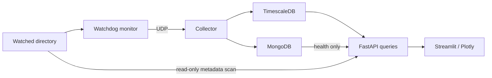

# FilePulse

> Metadata-only filesystem monitoring and analytics using Python, Watchdog, UDP,
> TimescaleDB, MongoDB, and Pandas.

FilePulse combines a best-effort event pipeline, bounded time-series API, and a
Streamlit/Plotly dashboard. Statistical anomaly detection is not implemented.

## Quick start

Requirements: Docker Desktop/Engine and Docker Compose. No host Python is required.

1. Copy `.env.example` to `.env` (`Copy-Item .env.example .env` in PowerShell).
2. Set nonempty `POSTGRES_PASSWORD` and `MONGO_PASSWORD` in `.env`. Use random
   hexadecimal passwords for this local demo; the MongoDB URI interpolates the password.
3. Start the stack:

```sh
docker compose up --build -d
docker compose ps
```

The six services are `timescaledb`, `mongodb`, `collector`, `monitor`, `api`, and
`dashboard`. Open the dashboard at http://localhost:8501 and API documentation at
http://localhost:8000/docs. These two ports bind to localhost only; database and
UDP ports remain internal. The Python containers run as a non-root user with
read-only filesystems and a temporary `/tmp`. Database data lives in named volumes.
The initial SQL runs on a fresh PostgreSQL volume; restarting does not reapply it.

## Generate activity

Create `watched_data/demo/` first. The generator has **only that directory writable**,
no database credentials, and no network. It never modifies files outside its own
new demo run directory. The monitor sees the full watched directory read-only.

PowerShell:

```powershell
New-Item -ItemType Directory -Force watched_data/demo | Out-Null
docker run --rm --network none --read-only --tmpfs /tmp --cap-drop ALL --security-opt no-new-privileges:true --mount "type=bind,source=$($PWD.Path)/watched_data/demo,target=/app/watched_data/demo" -e WATCH_ROOT=/app/watched_data filepulse:phase1 python -m scripts.generate_activity --profile normal
```

POSIX shell:

```sh
mkdir -p watched_data/demo
docker run --rm --network none --read-only --tmpfs /tmp --cap-drop ALL --security-opt no-new-privileges:true --mount "type=bind,source=$(pwd)/watched_data/demo,target=/app/watched_data/demo" -e WATCH_ROOT=/app/watched_data filepulse:phase1 python -m scripts.generate_activity --profile normal
```

Replace `normal` with `burst` for 100 files instead of 6. Each run creates, appends,
renames, and deletes files in stages, waiting 2.5 seconds between stages. Set
`--interval` to at least twice `POLL_INTERVAL` if increasing the polling interval;
pass the same `POLL_INTERVAL` into the generator container.

## Static analysis

This is a one-off command using the monitor image and its read-only mount:

```sh
docker compose run --rm --no-deps monitor python -m app.analytics.static_analysis --limit 10
```

The JSON output contains file counts, bytes, average/median/p95 sizes, extension
counts and storage, size/depth distributions, largest/recent/oldest files, and empty
files. Top tables are limited to 1–100 rows. A scan reads metadata only, skips
symlinks and inaccessible/raced entries, and reports the skipped count. Empty
scans are valid. Root-level depth is zero. "Oldest" means oldest modification time;
creation time is included only when the platform exposes reliable birth time.
The tracked `.gitkeep` is an ordinary empty file and is counted in scans.

## Verification

```sh
docker compose run --rm --no-deps monitor ruff check --no-cache .
docker compose run --rm --no-deps monitor pytest -m "not integration" -p no:cacheprovider
docker compose run --rm collector pytest -m integration -p no:cacheprovider
```

Integration tests require the running stack. They verify real inserts, idempotent
replays, hypertable/index structure, a bounded `time_bucket()` query, and malformed
UDP followed by a valid event through the running collector. API tests cover safe
failures, validation, scan concurrency and caching. Query integration tests verify
real bounded buckets, gaps, coverage, rates, and deterministic pagination.

## Dashboard and API

Overview, Live Activity, File Analysis, and System expose real data; Anomalies is
an explicit placeholder. Live Activity polls every ten seconds while viewing the
newest page. Browsing older pages pauses automatic updates.

| Route | Purpose |
| --- | --- |
| `GET /health` | Independent dependency health and scan-cache state |
| `GET /api/v1/overview` | Static metrics and bounded activity summary |
| `GET /api/v1/activity/timeseries` | UTC gap-filled event buckets |
| `GET /api/v1/events` | Canonical events, newest first |
| `GET /api/v1/files/summary` | Metadata statistics and bounded top-file tables |
| `GET /api/v1/files/extensions` | Scanned extension counts and bytes |
| `POST /api/v1/files/scan` | Explicit refresh, with an empty JSON object |

Activity routes accept `window=1h|6h|24h|7d` (default `24h`) and optional
`event_type=created|modified|deleted|moved`. Timeseries also accepts
`bucket=1m|5m|15m|1h` (default `15m`). Query bounds are `[start,end)` in UTC;
edge buckets represent only the portion within these bounds. Events support
`limit` (1–200, default 50) and `offset` (0–10000). Fetching one extra row determines
`has_more`. Ordering is `timestamp DESC, event_id DESC`; new arrivals can shift
offset pages. No unbounded history endpoint is provided.

Activity counts include files and directories. Unique File Paths and extension
rankings exclude directories; path count does not imply inode identity. Bytes
Changed sums absolute known file size deltas, never estimates missing values.
Coverage counts file modifications plus moves with a measured nonzero size delta.
Creates, deletes, directories, and pure moves are not coverage-eligible. No eligible
events means zero changed bytes; eligible events without any measurement mean null.
The UI displays measurement coverage alongside changed bytes. Events/min means the
last 60 seconds; Events Today means **Today (UTC)**. Both respect the event filter.

The API owns a single process-local scan cache and runs one worker. The first
static-data request, including Overview, performs one metadata-only scan protected
by a concurrency lock. Later requests reuse it until explicit Scan. Successful
Scan immediately clears/refetches all static-dependent dashboard caches, including
Overview. Failed refresh preserves the last successful result as stale; initial
failure requires explicit retry. Health never scans. Restarting the API discards
the snapshot. Dashboard caches last ten seconds for activity and up to 45 seconds
for static responses, but expiration does not cause another filesystem scan.

Health checks inspect both databases independently. MongoDB failure does not block
TimescaleDB analytics, and static scans can work during either database outage.
Collector and monitor liveness is not measured: recent persisted events are not
proof of process health. Health responses never expose credentials or connection
strings. The dashboard only uses the API, without DB credentials or filesystem mounts.



## Design decisions and limitations

- Watchdog's one-second polling observer is the default for Docker bind mounts.
  `OBSERVER_MODE=native` enables OS notifications where supported. Polling can
  miss sufficiently short-lived states and merge rapid modifications.
- JSON/UDP is a small demonstration of datagram transport. It has no ordering,
  acknowledgements, authentication, delivery guarantees, or event retries.
- TimescaleDB is the normalized analytical store; MongoDB retains raw validated
  documents. Writes are independent best-effort operations. Outage events are
  never replayed or recovered, so the stores can differ.
- Replays preserve their original timestamp. The SQL composite key and MongoDB
  `_id` are sufficient; no extra deduplication mechanism exists.
- Size deltas are measured only against known in-memory sizes. Deleted sizes and
  unknown previous sizes yield null deltas. Directory moves invalidate cache
  prefixes rather than rebuilding every descendant immediately.
- One trusted local directory is monitored. No file contents are read by monitoring
  or analytics. Demo generation writes synthetic contents but does not inspect them.
- This local project has no authentication or distributed monitoring. The isolated
  Compose network is not protection against a hostile container on the same network.

Stop services with `docker compose down`; named volumes are retained.
