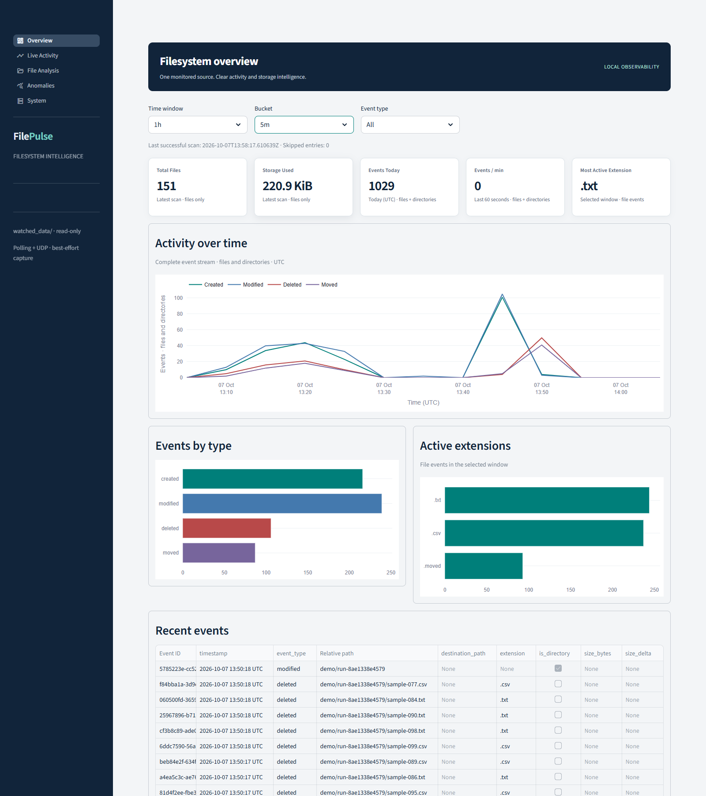
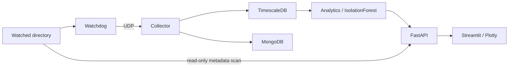
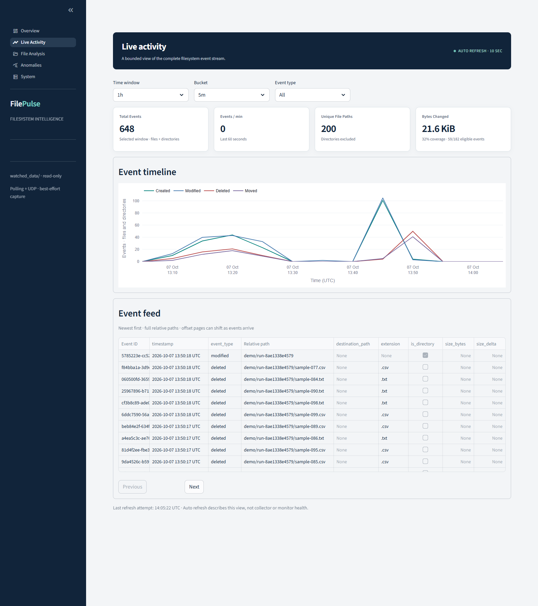
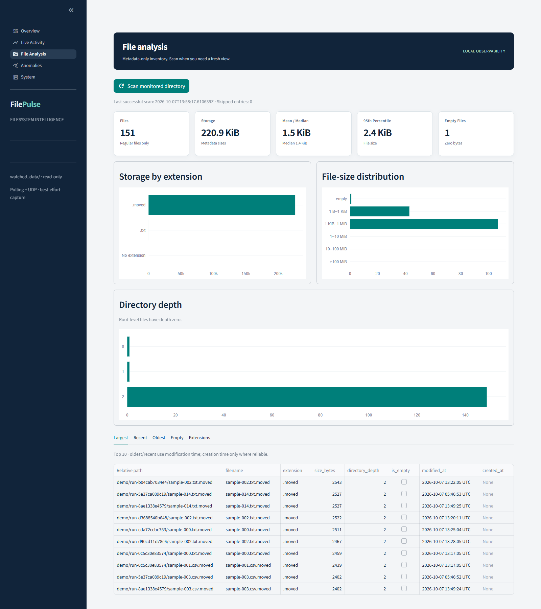
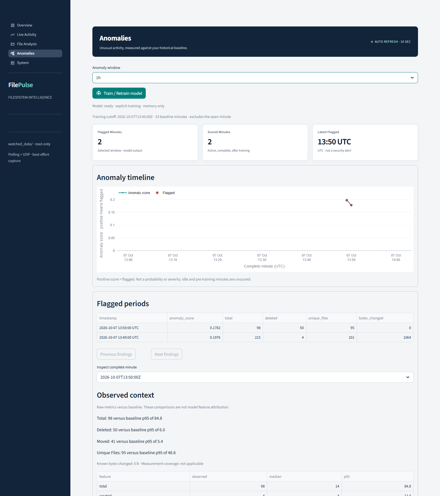

# FilePulse

FilePulse monitors filesystem activity and turns it into live analytics. It combines a metadata-only Python event pipeline, a Streamlit dashboard, and IsolationForest detection for statistically unusual activity.



## What it does

- Tracks file and directory creation, modification, moves, and deletion.
- Shows live activity, UTC time-series reports, and exact relative paths.
- Analyzes file counts, storage, extensions, sizes, and modification times.
- Trains on historical activity and scores new, completed minutes for unusual patterns.

## How it works



**Stack:** Python 3.12, Pandas, FastAPI, Streamlit, Plotly, PostgreSQL/TimescaleDB, MongoDB, scikit-learn, Watchdog, and Docker.

TimescaleDB stores canonical events and aggregates bounded time windows. MongoDB keeps validated raw documents. Pandas handles filesystem statistics and model feature preparation. The dashboard talks only to FastAPI.

## Dashboard







Activity refreshes every ten seconds; older event pages pause automatic updates. File Analysis uses a cached metadata scan until you select **Scan monitored directory**. Events Today means midnight UTC onward, and Events/min covers the trailing 60 seconds.

## Running it

Install Docker with Compose. Copy `.env.example` to `.env` and set `POSTGRES_PASSWORD` and `MONGO_PASSWORD` to random hexadecimal passwords.

```sh
docker compose up --build -d
```

Open the [dashboard](http://localhost:8501) or [API documentation](http://localhost:8000/docs). Both bind to localhost; database and UDP ports stay internal. Existing named database volumes are preserved across restarts.

Create `watched_data/demo/`, then generate real activity. The generator receives writable access only to that directory, with no network or database credentials.

PowerShell:

```powershell
New-Item -ItemType Directory -Force watched_data/demo | Out-Null
docker run --rm --network none --read-only --tmpfs /tmp --cap-drop ALL --security-opt no-new-privileges:true --mount "type=bind,source=$($PWD.Path)/watched_data/demo,target=/app/watched_data/demo" -e WATCH_ROOT=/app/watched_data filepulse:phase1 python -m scripts.generate_activity --profile normal
```

POSIX shell:

```sh
mkdir -p watched_data/demo
docker run --rm --network none --read-only --tmpfs /tmp --cap-drop ALL --security-opt no-new-privileges:true --mount "type=bind,source=$(pwd)/watched_data/demo,target=/app/watched_data/demo" -e WATCH_ROOT=/app/watched_data filepulse:phase1 python -m scripts.generate_activity --profile normal
```

Use `--profile burst` for a larger batch. Use `--profile baseline` on a fresh installation to collect 31 varied, minute-spaced rounds; allow roughly 32 minutes. Existing history can satisfy training without this step. If you change polling frequency, keep generator stages at least two polling intervals apart.

## Analytics and anomaly detection

Select **Train / Retrain model** on Anomalies. Training uses active, complete one-minute buckets from the previous seven days: at least 30 buckets, at least 30 minutes between the earliest and latest starts, and three distinct activity patterns. Idle buckets do not count. Thirty consecutive buckets alone span only 29 minutes.

IsolationForest learns event counts, distinct file paths, and extension diversity using log-transformed inputs. Baseline comparisons stay in original units. Bytes changed includes only observed deltas and is supporting context, not a model feature.

Generate new activity after training and wait for its minute to finish. Only completed minutes after the training cutoff are scored. A positive score is flagged; it is not a probability, severity rating, or evidence of an attack. **Observed context** compares metrics with baseline median/p95 and does not explain model feature attribution.

Models live in API memory. Restarting the API requires explicit training again. Failed retraining retains the previous usable model; insufficient history produces an honest state without fabricated findings.

## Tests

GitHub Actions runs Ruff and the non-integration suite on pushes and pull requests. With the stack running, run the complete suite:

```sh
docker compose run --rm --no-deps monitor ruff check --no-cache app scripts tests
docker compose run --rm --no-deps -e HOME=/tmp collector pytest -p no:cacheprovider
```

Tests cover path safety, UDP validation, real persistence and TimescaleDB queries, scan caching, API contracts, model boundaries, scoring, and dashboard failure states.

## Limitations

- Polling can miss short-lived states; UDP is best-effort without acknowledgements or retries.
- Database writes are independent. Outage events are not recovered, so stores may differ.
- Size deltas can be unknown. They are never estimated, and coverage is displayed separately.
- Static scans and models are process-local. There are no background scans or automatic retraining.
- Detection depends on the observed baseline and may flag ordinary activity or miss unusual behavior. Idle periods are unscored.
- This is a trusted local demo without authentication; collector and monitor heartbeats are not measured.
